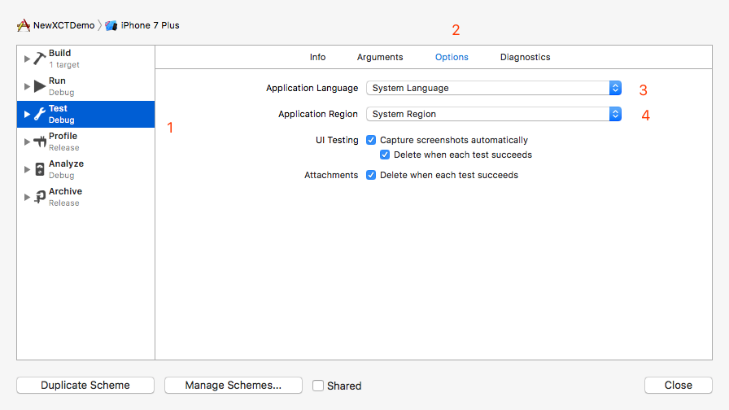
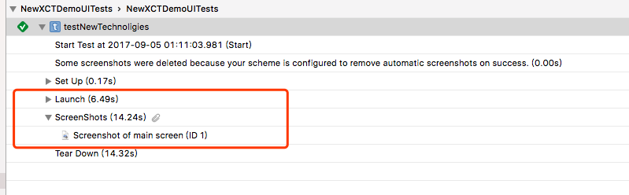

# What’s New in Testing

### 概述
Session-409的主题为[What’s New in Testing](https://developer.apple.com/videos/play/wwdc2017/409/)，主要包括：
-  **Enhancement
	优化了macOS、xcodebuild在UT中的性能
- **New Asynchronous Testing API
	提供新的接口和新的等待方式，让异步测试更加灵活
- ** Multiple App Testing
	编写测试代码，实现在多个App间自动跳转、测试
- ** Implements For UITesting
	改进UITest，优化element选取的算法
- **New Technologies
	新的Activities、attachments、screenshot技术

### Enhancement
1. Xcode8：XCUISiriTest用于便携SiriKit的Unit Test；支持Touchbar的UITest
2. Xcode9：改良了swift4的接口，基于block的 Teardown API
3. 改进macOS的菜单栏的UI test
4. 使用命令行进行测试，直接启动core simulator进行测试，不会再看到在测试过程中启动模拟器了
5. 持续集成场景下，Xcodebuild支持多个设备平行测试，Xcode server可以取代macOS server，进行持续化集成，App测试
6. 对于有国际化需求的App，在Xcode9的scheme中可以选择语言和地区。应用场景：写UI Test case生成不同国家对应的截图，用于App Store的图片介绍界面，可以节约大量的时间，否则只能统一是用一种展示方式：
	 

### New Asynchronous Testing API
#### 新老API比较
早在Xcode6中就已经有了异步测试API，使用上也比较简单，性能方面也算可以，但是有几个缺点：
- 等待超时会被视为测试失败，在某些情况下我们想对超时的情况做一些特殊的逻辑处理时，老API无法满足这个需求

- 等待代码中需要持有XCTestExpectation对象，等待的代码往往与测试逻辑的代码混杂在一起，想要把测试代码与支持代码变得困难
	[[Downloader new] downloadWithCompletion:^(BOOL success, NSError *err) {
	        XCTAssert(success, @"failed");
	        [_exception fulfill];
	}];
	 // 隐式等待，内部可能持有了expectation对象   
	[self waitForExpectationsWithTimeout:10 handler:^(NSError * _Nullable error) {
	        NSLog(@"timeout");
	}];

- 需要等到所有处于活跃XCTestExpectation对象全部执行 `fulfill `后才会返回
- 老的设计模式不支持嵌套waiting

所以，Apple推出了新的API: **XCTWaiter**，它将`waiting`、`XCTestCase`、`XCTestExpectation`解耦，除此之外：
- 指明等待的XCTestExpectation对象，
	[XCTWaiter waitForExpectations:@[donwloadException] timeout:0.5 enforceOrder:NO];
- delegate回调, 返回结果XCTWaiterResult，允许指定顺序
	XCTWaiterResult result = [[XCTWaiter alloc] initWithDelegate:self] waitForExpectations:@[donwloadException] timeout:0.5 enforceOrder:YES];
- 支持嵌套
#### Demo
[demo 地址](#)

### Multiple app test
Xcode9允许通过Bundle ID 和 fileURL(macOS)来创建一个XCUIApplication对象，以便于多个App测试。`launch`和`activate`可用来将APP从后台拉到前台，区别在于：*如果app在运行中，activate不会打断app*。
[demo](#)

#### First Match

### New Technologies
#### Activities
用于将散落的Testing语句整理在一个Group中
#### attachments
测试报告中可以包含更多的信息，如：截屏
#### screenshots
新增`XCUIScreenshotProviding`，遵循了这个协议的，即可调用`screenshot`方法获取屏幕截图

	- (void)testNewTechnoligies {
	    
	    // 创建Launch Activity
	    [XCTContext runActivityNamed:@"Launch" block:^(id<XCTActivity>  _Nonnull activity) {
	        XCUIApplication *app = [[XCUIApplication alloc] init];
	        app.launchArguments = @[@"-StartFromSlate", @"YES"];
	        [app launch];
	    }];
	    
	    // 创建ScreenShots Activity
	    [XCTContext runActivityNamed:@"ScreenShots" block:^(id<XCTActivity>  _Nonnull activity) {
	        // 生成主屏幕截图
	        XCUIScreenshot *screenShot = [[XCUIScreen mainScreen] screenshot];
	        // 将截屏添加到附件中
	        XCTAttachment *attachment = [XCTAttachment attachmentWithScreenshot:screenShot];
	        // 确保测试成功后attachment不会被自动删除
	        attachment.lifetime = XCTAttachmentLifetimeKeepAlways;
	        // attachment添加到activity中
	        [activity addAttachment:attachment];
	    }];
	}

测试报告中，生成了两个activity，screenshots activity还包含一张屏幕截图：
